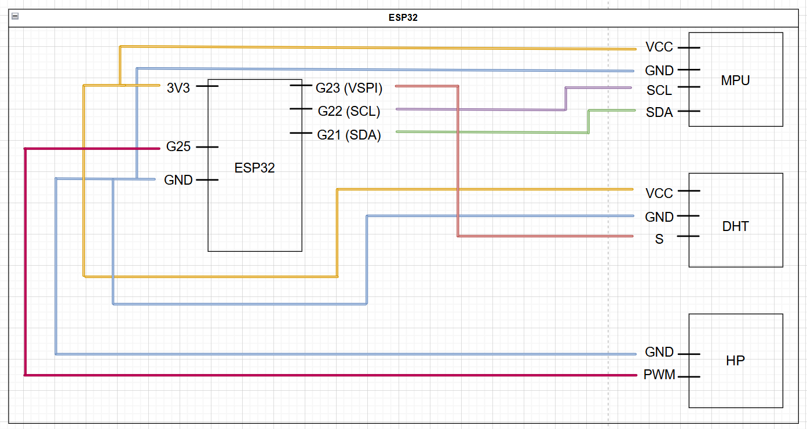

# ynov-hackathon

## Présentation

Le but de ce mini projet (2 jours entiers en école) a été de capturer les données de plusieurs capteurs, éparpillés sur plusieurs cartes ESP32. Ces cartes doivent récupérers les informations entre elles, les traduire en pourcentage puis générer un fichier CSV. Ce projet se finalise par une présentation orale de 10 minutes. Les supports sont les suivants :

- [Livrable écrit](https://auvencecom-my.sharepoint.com/:w:/g/personal/nicolas_delahaie_ynov_com/ET_Y2Dug_ypFgVER7NmtvpkBEwD5tL5Eg1HxeWj77scYrA?e=8hKMB4)
- [Support de présentation orale](https://docs.google.com/presentation/d/1ZGAcrIUciwRXjnxGBufEVFP3JYFAxEAnUVOqkkDy7VM/edit#slide=id.g32844c0cf97_0_250)

## Configuration des ESP32

1. Télécharger le driver **'CP210x Universal Windows Driver'** si vous êtes sur Windows :  
   [Lien de téléchargement](https://www.silabs.com/developer-tools/usb-to-uart-bridge-vcp-drivers?tab=downloads).
2. Télécharger **Thonny** :  
   [Lien de téléchargement](https://thonny.org/).
3. Ouvrir **Thonny**.
4. Configurer l'interpréteur :
   - Aller dans **'Exécuter'** dans la barre d'outils.
   - Cliquer sur **'Configurer l'interpréteur'**.
   - Sélectionner le type d'interpréteur : **'MicroPython (ESP32)'**.
   - Sélectionner le bon port : **'CP2102 US to UART Bridge Controller @ COM3'**.
   - Cliquer sur le lien **'Installer ou mettre à jour MicroPython (esptool) (UF2)'**.
   - Cliquer sur **'OK'**.

## Injection du code dans les ESP32

1. Téléchargez ce projet.
2. Ouvrir **Thonny** avec l'ESP32 branché et configuré.
3. Afficher les fichiers sur l'ESP32 :
   - Aller dans **'Affichage'** dans la barre d'outils.
   - Cocher **'Fichiers'**.
   - Vous devriez voir un fichier **'boot.py'** dans votre ESP32.
4. Ajouter les bons fichiers dans les bons ESP32 :
   - Entrez les adresses mac des ESP esclaves dans le script maitre.
   - Entrez l'adresse mac des ESP maitre dans les scripts esclaves.
   - Mettre le fichier **'esclave1.py'** dans l'ESP32 esclave qui embarque le capteur l'accéléromètre.
   - Mettre le fichier **'esclave2.py'** dans l'ESP32 esclave qui embarque le capteur l'accéléromètre.
   - Mettre le fichier **'maitre.py'** dans l'ESP32 maitre qui embarque un capteur accéléromètre et la capteur d'humidité.

## Branchements

